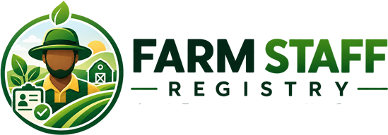

<div align="center">



# Farm Staff Registry (FSR)

### *Trust. Transparency. Better Farms.*

**A centralised digital platform for agricultural workforce verification, trust scoring and employer reputation management in Ondo State, Nigeria.**

[](https://php.net)
[](https://codeigniter.com)
[](https://mysql.com)
[](LICENSE)
[](https://doi.org/10.5281/zenodo.22681601)
[](https://farmstaff.ng)

---

[Features](#-features) • [Screenshots](#-screenshots) • [Installation](#-installation) • [Usage](#-usage) • [Architecture](#-architecture) • [Research](#-research--citation) • [License](#-license)

</div>

---

## 📌 What is Farm Staff Registry?

The **Farm Staff Registry (FSR)** is a web-based platform built for **agricultural employers and farm workers in Ondo State, Nigeria** that enables employers to:

- **Register** farm workers with verified identity documents and photographs
- **Track** complete employment history across multiple farms
- **Verify** practical agricultural skills with employer-backed ratings
- **Monitor** attendance and compute reliability scores
- **Report** workplace incidents through a confidential, admin-moderated pipeline
- **Check** any worker's background before hiring using their phone number or registry ID
- **Rate** farms anonymously — building a public Farm Reputation Score

Each worker receives a single central profile and a dynamic **Trust Score (0–100)** that reflects their verified work performance, conduct and attendance history across all employers on the platform.

---

## 🚨 Problem Being Addressed

Agricultural labour markets in Nigeria — and across Sub-Saharan Africa — are predominantly informal. Employers hiring farm workers face:

| Challenge | Impact |
|-----------|--------|
| No verifiable identity records | Risk of hiring unknown individuals |
| No employment history | Repeat misconduct goes undetected |
| No skill verification | Mismatch between claimed and actual skills |
| No accountability mechanism | Misconduct without consequence |
| Information asymmetry | Employers and workers both operate blindly |

> *"The market for lemons"* — Akerlof (1970) — describes exactly this: when buyers cannot verify quality, bad actors drive out good ones. FSR directly solves this for agricultural labour markets.

The Farm Staff Registry creates a **trusted, centralised, cross-employer record** that benefits all parties — employers make better hiring decisions, good workers build verifiable reputations, and the agricultural labour market becomes more efficient and accountable.

---

## ✨ Features

### 👤 Worker Management
- Central worker profile with photo, ID verification and biographic data
- Auto-generated unique Registry ID (`FSR-XXXXXX`)
- Trust Score initialised at 50, dynamically adjusted by verified events
- Status management: Active · Inactive · Flagged · Suspended

### 📋 Employment History
- Portable work history ledger across all registered employers
- Role, start/end dates, duration, responsibilities and employer remarks
- Multi-employer timeline visible during background checks

### 🏆 Skills Verification
- Employer-submitted skill ratings (1–5 stars, proficiency levels)
- Admin verification badge for confirmed practical skills
- Common agricultural skill library (Tractor Driving, Harvesting, Spraying, etc.)

### 📅 Attendance Tracking
- Daily attendance logging (present / absent / late / half-day / leave)
- Monthly calendar view with check-in/check-out times
- Computed Attendance Score: `((Present + Late×0.5) / Total) × 100`

### ⚠️ Incident Reporting
- Confidential misconduct reports with evidence file upload
- Admin moderation gate — incidents only affect records after review
- Severity classification: Minor · Moderate · Severe
- Disciplinary points deducted from Trust Score on acceptance

### 💯 Trust Score System
- Multi-dimensional scoring: performance ratings + attendance + incidents
- Score range: 0–100 (High ≥70 · Medium 40–69 · Low <40)
- Full immutable score change log with reasons and timestamps
- Manual admin adjustment with audit trail

### 🔍 Background Check
- Search any worker by phone number or Registry ID before hiring
- Returns: identity, work history, skills, ratings, trust score, incident count
- Every search logged for audit purposes

### 🏚️ Farm Reputation Score
- Workers anonymously rate farms on: conditions, safety, payment, treatment
- Admin moderation before ratings affect public score
- Weighted average displayed on employer profile

### 🛡️ Admin Panel
- Full platform dashboard with KPIs and pending action alerts
- Worker and employer management with status controls
- Incident review queue with accept/reject workflow
- Reports and analytics with Chart.js visualisations
- Complete audit trail of all system activity
- Trust score management and skill verification

---

## 📸 Screenshots

> *Screenshots can be added to a `/docs/screenshots/` folder and referenced here.*

| Public Homepage | Employer Dashboard | Admin Panel |
|:-:|:-:|:-:|
|  |  |  |

| Worker Profile | Background Check | Incident Review |
|:-:|:-:|:-:|
|  |  |  |

---

## 🛠 Technologies Used

| Layer | Technology | Version |
|-------|-----------|---------|
| Backend Language | PHP | 8.1+ |
| Backend Framework | CodeIgniter | 3.1.x |
| Database | MySQL | 8.0+ |
| Web Server | Apache | 2.4+ |
| Admin UI | KT Metronic (Demo 1) | Bundled |
| Public UI | Custom CSS (farmstaff.css) | 1.0 |
| JavaScript | jQuery + Vanilla JS | 3.x |
| Charts | Chart.js | 3.x |
| Icons | Flaticon · Line Awesome · FontAwesome | Bundled |
| Password Hashing | PHP `password_hash()` | bcrypt cost 12 |
| Development Env | Laragon | 6.x |

---

## 📦 Installation

### Prerequisites

Before you begin, ensure you have:
- **PHP 8.1+** with extensions: `mysqli`, `mbstring`, `openssl`, `fileinfo`
- **MySQL 8.0+**
- **Apache 2.4+** with `mod_rewrite` enabled
- **Laragon** (recommended for Windows local development) or XAMPP / WAMP / LAMP

---

### Step 1 — Clone the Repository

```bash
git clone https://github.com/kennysoft03/Farmstaff_AKD.git
```

For **Laragon on Windows**, clone directly into the Laragon `www` folder so the virtual host is created automatically:

```
C:\laragon\www\Farmstaff\
```

The cloned folder contains the following **in the root directory**:

```
Farmstaff/
├── system/              ← CodeIgniter 3 system folder (included in repo)
├── application/         ← Application code
├── assets/              ← Public CSS, JS, images
├── assetsa/             ← Admin template assets
├── workings/            ← Design mockups
├── farmstaff.sql        ← Database schema — import this
├── index.php            ← CI3 front controller
└── .htaccess            ← URL rewriting
```

> ✅ The **CodeIgniter 3 `system/` folder is included** in the root directory of  
> this repository. You do not need to download CodeIgniter separately.

---

### Step 2 — Create and Import the Database

#### 2a — Create the database

Open **HeidiSQL**, **phpMyAdmin**, or MySQL CLI and create the database.  
The database **must be named exactly** as specified in `application/config/database.php`:

```sql
CREATE DATABASE farmstaff
  CHARACTER SET utf8mb4
  COLLATE utf8mb4_unicode_ci;
```

> The required database name is **`farmstaff`** — this must match exactly.

#### 2b — Import the schema

The SQL file is located at the **root of the repository**: `farmstaff.sql`

**Option A — HeidiSQL:**
1. Open HeidiSQL and connect to your MySQL server
2. Select the `farmstaff` database in the left panel
3. Click **File → Run SQL file**
4. Select `farmstaff.sql` from the project root folder
5. Click **Open** — all 13 tables will be created automatically

**Option B — phpMyAdmin:**
1. Select the `farmstaff` database
2. Click the **Import** tab
3. Choose `farmstaff.sql` from the project root
4. Click **Go**

**Option C — MySQL CLI:**
```bash
mysql -u root -p farmstaff < farmstaff.sql
```

After import you should see these 13 tables:
```
fs_admin_users      fs_attendance        fs_audit_logs
fs_background_checks  fs_employers       fs_farm_ratings
fs_incidents        fs_notifications     fs_skills
fs_trust_score_log  fs_work_history      fs_worker_ratings
fs_workers
```

---

### Step 3 — Configure the Database Connection

The database connection is set directly in `application/config/database.php`.  
Open the file and update the `default` group with your local MySQL credentials:

```php
$db['default'] = array(
    'hostname'    => '127.0.0.1',   // MySQL host — usually 127.0.0.1 or localhost
    'username'    => 'root',         // Your MySQL username
    'password'    => '',             // Your MySQL password (blank for Laragon default)
    'database'    => 'farmstaff',    // Must match the database name you created in Step 2
    'dbdriver'    => 'mysqli',
    'dbprefix'    => '',
    'pconnect'    => FALSE,
    'db_debug'    => TRUE,           // Set FALSE in production
    'char_set'    => 'utf8mb4',
    'dbcollat'    => 'utf8mb4_unicode_ci',
    // ... other settings remain unchanged
);
```

> The database name **must be `farmstaff`** — this matches the schema in `farmstaff.sql`.

---

### Step 4 — Set the Base URL

Edit `application/config/config.php` and update the `base_url` to point to  
**wherever the application is located** on your server:

```php
// For Laragon local development:
$config['base_url'] = 'http://farmstaff.test:9090/';

// For XAMPP local development:
$config['base_url'] = 'http://localhost/Farmstaff/';

// For a live server with a domain:
$config['base_url'] = 'https://yourdomain.com/';

// For a live server in a subdirectory:
$config['base_url'] = 'https://yourdomain.com/farmstaff/';
```

> The `base_url` must end with a trailing slash `/` and must exactly match  
> the URL you use to access the application in your browser.

---

### Step 5 — Set Directory Permissions

Ensure these directories are **writable** by the web server:

**Linux / macOS / cPanel:**
```bash
chmod 755 sessions/
chmod 755 uploads/
chmod 755 uploads/workers/
chmod 755 uploads/workers/ids/
chmod 755 uploads/incidents/
chmod 755 uploads/employers/
chmod 755 application/logs/
chmod 755 application/cache/
```

**Windows (Laragon / XAMPP):** These folders are writable by default — no action needed.

---

### Step 6 — Configure Virtual Host (Laragon on Windows)

If using **Laragon**, the virtual host `farmstaff.test` is created automatically  
when the project folder is inside `C:\laragon\www\`.

Add the following line to your `hosts` file:

```
# Location: C:\Windows\System32\drivers\etc\hosts
127.0.0.1  farmstaff.test
```

> To edit the hosts file on Windows, open Notepad as Administrator and open the file above.

---

### Step 7 — Verify CodeIgniter System Folder

Open `index.php` in the root of the project and confirm these two lines:

```php
$system_path      = 'system';       // ← CI3 system folder in root directory
$application_folder = 'application'; // ← Application folder in root directory
```

Since the `system/` folder is **included in this repository at the root level**,  
these default values are correct and require no changes.

---

### Step 8 — Create the Default Admin User

Start your web server (Laragon / XAMPP) and visit:

```
http://farmstaff.test:9090/admin/create-admin
```

You will see a confirmation message. The default admin account is created:

| Field | Value |
|-------|-------|
| Username | `admin` |
| Password | `Admin@1234` |

> ⚠️ **Change this password immediately** after your first login at `/admin`

---

### Step 9 — Test the Installation

Visit the following URLs to confirm everything is working:

| Test | URL | Expected Result |
|------|-----|----------------|
| Public site | `http://farmstaff.test:9090/` | Homepage loads with green hero banner |
| Admin login | `http://farmstaff.test:9090/admin` | Admin login page appears |
| Employer register | `http://farmstaff.test:9090/register` | Registration form loads |
| 404 check | `http://farmstaff.test:9090/xyz` | Branded 404 page |

If the homepage shows a **database error**, recheck Step 3 (env-database.php credentials).  
If you see **"Your system folder path does not appear to be set correctly"**, recheck Step 7.

---

### Common Issues & Fixes

| Problem | Cause | Fix |
|---------|-------|-----|
| White page / 500 error | PHP version < 8.1 | Update PHP to 8.1+ |
| Database connection error | Wrong credentials in env-database.php | Recheck Step 3 |
| "system folder not found" | system/ folder missing or wrong path | Confirm system/ is in root, check index.php Step 7 |
| CSS/JS not loading | Wrong base_url | Update base_url in config.php Step 4 |
| 404 on all pages | mod_rewrite not enabled | Enable mod_rewrite in Apache |
| Upload fails | uploads/ not writable | Set permissions Step 5 |
| Session errors | sessions/ not writable | Set permissions Step 5 |
| Admin login fails | Admin not created | Run `/admin/create-admin` Step 8 |

---

## 🚀 How to Run It

### Local Development (Laragon)

1. Start **Laragon** and ensure Apache and MySQL are running
2. Clone the repo into `C:\laragon\www\Farmstaff\`
3. Complete the installation steps above (Steps 1–9)
4. Visit: `http://farmstaff.test:9090/`

### Default Login Credentials

| Portal | URL | Username | Password |
|--------|-----|----------|----------|
| **Admin Panel** | `/admin` | `admin` | `Admin@1234` |
| **Employer Portal** | `/login` | *(register first)* | *(set during registration)* |

> ⚠️ **Change the admin password immediately** after first login.

### Key URLs

| Page | URL |
|------|-----|
| Public Homepage | `http://farmstaff.test:9090/` |
| Employer Login | `http://farmstaff.test:9090/login` |
| Employer Register | `http://farmstaff.test:9090/register` |
| Employer Dashboard | `http://farmstaff.test:9090/dashboard` |
| Background Check | `http://farmstaff.test:9090/dashboard/background-check` |
| Admin Login | `http://farmstaff.test:9090/admin` |
| Admin Dashboard | `http://farmstaff.test:9090/admin/dashboard` |

---

## 🌐 Deployment

### Shared Hosting (cPanel)

1. Upload all files to `/public_html/` or a subdirectory
2. Create a MySQL database and user via **cPanel → MySQL Databases**
3. Import `farmstaff_db.sql` via **phpMyAdmin**
4. Copy and edit `env-database.php` with your cPanel DB credentials
5. Update `base_url` in `config.php` to your live domain
6. Ensure **PHP 8.1** is selected in MultiPHP Manager
7. Ensure `mod_rewrite` is enabled (contact host if needed)
8. Set directory permissions (755 for uploads and sessions)

### Production Security Checklist

```
[ ] Set ENVIRONMENT = 'production' in index.php
[ ] Set db_debug = FALSE in env-database.php
[ ] Change default admin password from Admin@1234
[ ] Delete or restrict access to install.php
[ ] Configure HTTPS / SSL certificate
[ ] Enable CSRF protection in config.php
[ ] Set display_errors = 0 in PHP configuration
[ ] Ensure uploads/ is not directly executable
[ ] Set up regular database backups
[ ] Review .htaccess for production hardening
```

---

## 🏗 Architecture

```
┌─────────────────────────────────────────────┐
│              THREE PORTALS                  │
│  Public Site  │  Employer Portal  │  Admin  │
└───────┬───────┴─────────┬─────────┴────┬────┘
        │                 │              │
        └─────────────────▼──────────────┘
                    CodeIgniter 3 MVC
                 Controllers · Models · Views
                          │
                    Farmstaff_model
              (Trust Score · Reputation Engine
               Audit Logger · Notifications)
                          │
                    MySQL Database
                    (13 core tables)
```

**Full technical documentation:** [`docs/TECHNICAL_DOCUMENTATION.md`](docs/TECHNICAL_DOCUMENTATION.md)

### Database Tables

| Table | Purpose |
|-------|---------|
| `fs_admin_users` | Platform administrators |
| `fs_employers` | Registered farm employers |
| `fs_workers` | Central worker registry |
| `fs_work_history` | Portable employment ledger |
| `fs_skills` | Skill records and verification |
| `fs_attendance` | Daily attendance log |
| `fs_incidents` | Confidential misconduct reports |
| `fs_farm_ratings` | Worker ratings of employers |
| `fs_worker_ratings` | Employer ratings of workers |
| `fs_trust_score_log` | Immutable score change history |
| `fs_background_checks` | Search audit trail |
| `fs_audit_logs` | Full system activity log |
| `fs_notifications` | In-app notifications |

---

## 📚 Research / Project Background

This platform was developed as part of research into **digital trust frameworks for informal agricultural labour markets** in Sub-Saharan Africa, addressing the information asymmetry problem documented by Akerlof (1970) in the context of Nigerian agricultural employment.

### Research Context

> **Title:** *"A Digital Trust and Verification Framework for Agricultural Workforce Management: Design and Implementation of the Farm Staff Registry System"*
>
> **Organisation:** Farm Staff Registry — For Farmers in Ondo State, Nigeria
>
> **Problem Domain:** Informal agricultural labour markets, information asymmetry, workforce accountability
>
> **Novel Contributions:**
> 1. A centralised agricultural labour registry architecture for informal employment contexts in Sub-Saharan Africa
> 2. A multi-dimensional, event-driven Trust Score model (T(w) ∈ [0,100]) computed from heterogeneous employer inputs
> 3. A bidirectional reputation system providing mutual accountability for both workers and employers

### Trust Score Model

```
T(w) ∈ [0, 100],   T₀ = 50

Score Change = (rating - 3) × 5     [from performance ratings]
Score Change = -disciplinary_points  [from accepted incidents]

Bands:  High Trust ≥ 70
        Medium Trust 40–69
        Low Trust < 40
```

### Related Work
- Akerlof, G.A. (1970). The market for lemons. *Quarterly Journal of Economics*
- Resnick, P. et al. (2000). Reputation systems. *Communications of the ACM*
- Dellarocas, C. (2003). The digitization of word-of-mouth. *Management Science*
- FAO (2023). Agricultural employment in Nigeria

---

## 📄 How to Cite

If you use this software or reference it in academic work, please cite it as:

### Software Citation (APA)
```
[Author(s)]. (2026). Farm Staff Registry (FSR) [Computer software]. 
Farm Staff Registry — For Farmers in Ondo State, Nigeria. 
https://doi.org/10.5281/zenodo.22681601
```

### Software Citation (BibTeX)
```bibtex
@software{farmstaff_registry_2026,
  author       = {{Farm Staff Registry Development Team}},
  title        = {{Farm Staff Registry (FSR): A Centralised Digital Platform 
                   for Agricultural Workforce Verification and Trust Scoring}},
  year         = {2026},
  publisher    = {Farm Staff Registry — For Farmers in Ondo State, Nigeria},
  url          = {https://github.com/kennysoft03/Farmstaff_AKD},
  doi          = {10.5281/zenodo.22681601},
  note         = {Version 1.0.0}
}
```

### Research Paper Citation
> *(Update this section when the associated journal paper is published)*
```
[Author(s)]. (2026). A Digital Trust and Verification Framework for 
Agricultural Workforce Management. [Journal Name]. 
https://doi.org/10.5281/zenodo.22681601
```

### Zenodo Record
🔗 **[https://doi.org/10.5281/zenodo.22681601](https://doi.org/10.5281/zenodo.22681601)**

---

## 🤝 Contributing

Contributions, issues and feature requests are welcome.

1. Fork the repository
2. Create a feature branch: `git checkout -b feature/your-feature-name`
3. Commit your changes: `git commit -m 'Add: description of feature'`
4. Push to the branch: `git push origin feature/your-feature-name`
5. Open a Pull Request

### Planned Future Features
- [ ] Mobile app (React Native) for offline attendance capture
- [ ] Blockchain integration for immutable work history (Hyperledger Fabric)
- [ ] ML-based trust prediction from historical patterns
- [ ] NIN API integration for real-time identity verification (NIMC)
- [ ] Multi-state expansion beyond Ondo State
- [ ] Worker self-service portal for profile visibility
- [ ] SMS notifications for workers and employers

---

## 📁 Project Structure

```
Farmstaff/
├── application/
│   ├── config/          # Configuration files
│   ├── controllers/     # Home · Employer · Farmadmin
│   ├── models/          # Farmstaff_model (core)
│   ├── helpers/         # ci_helper
│   └── views/
│       ├── public/      # Public website views
│       ├── employer/    # Employer dashboard views
│       └── admin/       # Admin panel views
├── assets/              # Public CSS, JS, images
├── assetsa/             # KT Metronic admin template
├── uploads/             # User-uploaded files
├── sessions/            # Server-side session storage
├── docs/                # Technical documentation
│   └── TECHNICAL_DOCUMENTATION.md
├── .gitignore
├── farmstaff_db.sql     # Database schema (import once, then delete)
├── index.php            # CodeIgniter front controller
└── README.md
```

---

## 📜 License

```
MIT License

Copyright (c) 2026 Farm Staff Registry — For Farmers in Ondo State, Nigeria

Permission is hereby granted, free of charge, to any person obtaining a copy
of this software and associated documentation files (the "Software"), to deal
in the Software without restriction, including without limitation the rights
to use, copy, modify, merge, publish, distribute, sublicense, and/or sell
copies of the Software, and to permit persons to whom the Software is
furnished to do so, subject to the following conditions:

The above copyright notice and this permission notice shall be included in all
copies or substantial portions of the Software.

THE SOFTWARE IS PROVIDED "AS IS", WITHOUT WARRANTY OF ANY KIND, EXPRESS OR
IMPLIED, INCLUDING BUT NOT LIMITED TO THE WARRANTIES OF MERCHANTABILITY,
FITNESS FOR A PARTICULAR PURPOSE AND NONINFRINGEMENT. IN NO EVENT SHALL THE
AUTHORS OR COPYRIGHT HOLDERS BE LIABLE FOR ANY CLAIM, DAMAGES OR OTHER
LIABILITY, WHETHER IN AN ACTION OF CONTRACT, TORT OR OTHERWISE, ARISING FROM,
OUT OF OR IN CONNECTION WITH THE SOFTWARE OR THE USE OR OTHER DEALINGS IN
THE SOFTWARE.
```

---

<div align="center">

**Farm Staff Registry** — Built with ❤️ for the farmers and workers of Ondo State, Nigeria

</div>
